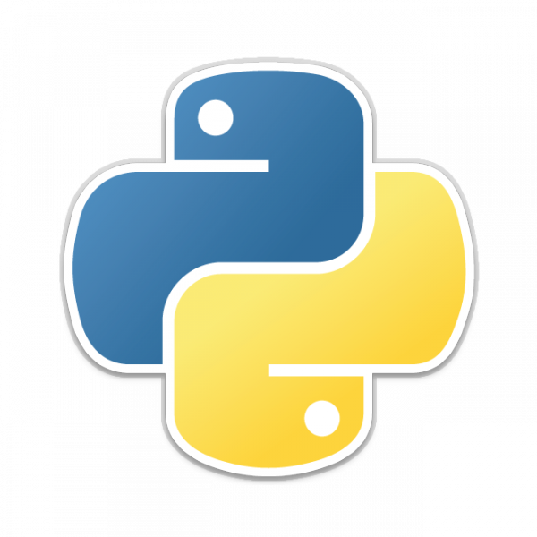

<!-- page_number: true -->
<!-- footer: Débuter en python - Partie 1 - https://git.io/vFxiU -->

# Débuter en python - Partie 1


###### Présenté par Guillaume Mousnier




---

# C'est qui le mec au tableau ?

**Guillaume Mousnier**

DataScientist | Développeur (Big Data) chez [TimeOne](http://timeonegroup.com)

Mail: mousnier.guillaume@gmail.com

Github: https://github.com/Gmousse

Langages: Python, JavaScript, Scala, R

---

# Prérequis

- Python3

> Installateur dispo sur https://www.python.org/ (windows, mac).
> Aussi dispo sur les gestionnaires de paquets linux.

- Un éditeur de texte de votre choix

> Atom (https://atom.io/ + https://atom.io/packages/language-python)
> VisualStudio (https://code.visualstudio.com/)

- Un terminal

---

# Plan

1. Introduction
2. Les variables
3. Les opérateurs
4. Les types primitifs
5. Les conditions
6. Les structures de données
7. Les boucles et autres types d'itérations
8. Les fonctions
9. Les erreurs
10. Les modules et les namespaces

---

# Introduction

## Présentation du langage

Publié en 1991 par Guido van Rossum.

Langage de haut niveau interprété et dynamiquement typé.

Extrêmement polyvalent (sciences, web, ...).

Supporte plusieurs paradigmes (procédural, orienté-objet, fonctionnel...).

Dispose de fonctionnalités modernes (imports, asynchrone, parallélisation...) .

---

# Introduction

## Philosophie et Syntaxe

Le python suit une philosophie minimaliste ([Zen of Python](http://docs.python-guide.org/en/latest/writing/style/#zen-of-python)).

Se veut simple à lire et à écrire (et donc à maintenir).

Adopte un style compact, basé sur les indentations.

Favorise le EAFP (*it's easier to ask for forgiveness than permission*) plutôt que le LBYL (*look before you leap*).

---

# Introduction

## Lancer python

Lancer le cli (command-line interface) de python:

`python`

Lancer un programme avec python:

`python /mon_chemin/mon_programme.py`
`python -m mon_module`


---


# Introduction

## Les commentaires

En python on peut définir un commentaire (texte qui ne sera pas interprété dans votre programme) avec `#`:

````python
# Ceci est un commentaire
"Ceci n'est pas un commentaire"

# Une petite opération
1 + 1  # Je crois que ça va faire 2!
````

On les utilisent pour ajouter des indications (doc) dans le code.

---


# Introduction

## Afficher un résultat en python

La fonction `print` permet d'afficher un ou plusieurs résultats dans la console.

Ainsi:

````python
print("Test")
print("Un et un font ", 1 + 1, "!")
````

Affichera dans la console (ou la sortie standard):
````python
Test
Un et un font 2 !
````

---

# Introduction

## Documentation

En mode console, il est possible d'obtenir la documentation d'une fonction, classe ou autres via la fonction `help`:

````python
help(print)
````

````
print(...)
    print(value, ..., sep=' ', end='\n', file=sys.stdout, flush=False)
    Prints the values to a stream, or to sys.stdout by default.
    Optional keyword arguments:
    file:  a file-like object (stream); defaults to the current sys.stdout.
    sep:   string inserted between values, default a space.
    end:   string appended after the last value, default a newline.
    flush: whether to forcibly flush the stream.
````

Sinon, il y a la doc python: https://docs.python.org/3/

---


# Introduction

## Les lignes d'instructions

Normalement on déclare une instruction (statement) par ligne:

````python
a + 4
a + 8
````

Il est possible mais non conseillé d'en déclarer plusieurs:

````python
a + 4;a + 8
````

---

# Introduction

## Les lignes d'instructions (2)

Ecrire une instruction (statement) sur plusieurs lignes est prohibé:
````python
a +
4
````

En effet celà provoque une erreur de parsing:

````
  File "<stdin>", line 1
    a +
       ^
SyntaxError: invalid syntax
````

---


# Introduction

## Les lignes d'instructions (3)

Pour des besoins de lisibilité on peut expliciter la continuation de la ligne via `\`:
````python
1 + 4 + 5 + 7 + 8 + 9 + 10 + 545784 + 6 + 9 +\
4 + 1 + 3\
+ 2
````

Lors de l'appel d'une fonction, on peut également déclarer les paramètres sur plusieurs lignes:
````python
print(
    parametre1,
    parametre2, parametre3
)
````

---

# Introduction

## Les indentations

Python utilise l'indentation pour séparer les blocs d'instructions d'un programme:

````python
a = 1

if a != 1:
   print("WHAAAT")

print(a)
````

Il convient d'être rigoureux:

````
IndentationError: unexpected indent
````

---

# Introduction

## Les indentations (2)

La taille de l'indentation importe peu:

````python
if a == 1:
           print("OUF")
````


Mais il faut être constant et rigoureux:

````python
if a == 1:
    print("OUF")
           print("THAT WAS EXPECTED")
````

````
  File "<stdin>", line 3
    print("THAT WAS EXPECTED")
    ^
IndentationError: unexpected indent
````

---

###### Exercice 01: Votre première commande en python
Instructions:
- Lancez le cli python.
- Affichez la phrase `Hello world !` en utilisant la fonction `print`.
- Affichez les opérations `2 + 2` et `4  - 1`  en utilisant une seule fonction `print`.

Résultats attendus:
- `Hello world !`
- `4 3`

---

###### Exercice 02: Votre première programme
Instructions:
- Créez un fichier hello_world.py.
- Dans ce fichier affichez la phrase `Hello world !` en utilisant la fonction `print`.
- Executez le program hello_world.py avec python.

Résultats attendus:
- `Hello world !`

---

# Les variables

## Déclarer une variable (1)

En python, la gestion des *objets* en mémoire et leur typage est dynamique.

Chaque valeur que vous allez utilisé se voit attribué un type et un id (localisation dans la mémoire):

````python
print(128, id(128), type(128))
````

````
128 139810890631904 <class 'int'>
````

---


# Les variables

## Déclarer une variable (2)

On peut affecter une valeur (e.g. 128) à un nom pour le manipuler à long terme:

````python
x = 128
print(128, id(128), type(128))
print(x, id(x), type(x))
````

````
128 139810890631904 <class 'int'>
128 139810890631904 <class 'int'>
````

On vient alors de *déclarer la variable* x.

---

# Les variables

## Déclarer une variable (3)

Affecter une valeur à une variable consiste à lui donner un alias.
On conserve l'id et le type de la valeur ainsi affectée.

On peut aussi affecter une variable à une autre variable:
````python
x = 128
y = x    # équivalent de x = y = 128
print(x, y, id(x), id(y))
````

````
128 128 139810890631904 139810890631904
````

y possèdera alors l'identité de x.

---

# Les variables

## Déclarer une variable (4)

On peut aussi déclarer plusieurs variables en même temps:

````python
a, b = 35, 24
print(a, b)
````

````
35 24
````

---


# Les variables

## Modifier une variable

Une variable peut varier dans le temps (!= constante).

On peut réattribuer la valeur assignée:

````python
x = x + 10 # équivalent de x += 10
print(x, y, id(x), id(y))
````

````
138 128 139810890632224 139810890631904
````

La valeur de x change, son id aussi.

y ne change pas car il ne partage plus le même id avec x.

---


# Les variables

## Modifier une variable (2)

**Attention!** Lorsque l'on travaille sur un objet complexe et que l'on effectue un passage par référence, on va impacter une variable qui partage cette objet.

````python
a = {"clef": "valeur"}; b = a
a["clef"] = "une autre valeur"
print(a, b)
print(id(a), id(b))
````

````
{'clef': 'une autre valeur'} {'clef': 'une autre valeur'}
139810876069496 139810876069496
````

Une modification par référence ne change pas l'id d'une valeur !!

---


# Les variables

## Modifier une variable (3)

Il est souvent conseillé de ne pas écraser une variable mais d'en créer une nouvelle:

````python
a = "Valeur"
b = a + "!"
````

Celà permet une lecture (et donc une maintenabilité) facilité du code.

---

# Les variables

## Supprimer une variable

Si une variable est inutile, on peut la supprimer (forcant ainsi python à la supprimer de la mémoire):

````python
a = "Valeur"
b = a
del a # on a plus besoin de a
print(b); print(a)
````

Si on appelle la variable supprimée (on verra pourquoi plus tard):

````
Valeur # b n'est pas supprimé, on supprime juste a
NameError: name 'a' is not defined
````
Il faut néanmoins utiliser la suppression avec prudence!

---

# Les variables

## Quid de la constante

La constante est un nom donné à une valeur qui ne doit pas changer au cours du temps.

On ne peut pas déclarer une *vrai* constante en python.

Par convention on crée juste une variable avec le nom en majuscule:

````python
MA_SUPER_CONSTANTE = 35 # DO NOT TOUCH OR JUST DIE
````

Et surtout on y touche pas!

---

# Les variables

## Conventions de nommage

Quand on crée une variable (mais aussi une classe ou une fonction), il convient de lui donner un nom clair.

Il est conseillé d'utiliser 1 convention parmis:
- CamelCase: `maSuperVariable = 3`
- SnakeCase: `ma_super_variable = 3`

Il faut en choisir une et s'y tenir.

Les caractères autorisés pour le nommage sont: `a...z`, `A...z`, `0...9`, `_`.

---

# Les variables

## Conventions de nommage (2)

**\/!\\** Ne pas lui donner le nom d'un builtins ou d'un module:

````python
print = "coucou"
print(12)
````

````
TypeError: 'str' object is not callable
````

Ou le nom d'un mot clef réservé:
````python
if = "coucou"
````
````
SyntaxError: invalid syntax
````

---

# Les types primitifs

## Liste des types primitifs

Python possède quelques types *primitifs*:
- `bool`: Boolean: 2 valeurs logiques `True` (1) ou `False` (0)
- `int`: Integer: nombre entier (`123`).
- `float`: Float: nombre à virgule (`3.14159`).
- `str`: String: chaîne de charactères, texte (`":D"` ou `':D'`).
- `None`: None ou null: valeur manquante ou nulle.

Détails: https://docs.python.org/3/library/stdtypes.html

---

# Les types primitifs

## Vérifier un type

La fonction `type` donne le type d'une valeur:
````python
a = "coucou"
print(type(a))
````
````
<class 'str'>
````

La fonction `isinstance` vérifie qu'une variable est une *instance* d'un type (et donc d'une classe):
````python
print(isinstance(a, str), isinstance(a, int))
````
````
True False
````
---

# Les types primitifs

## Déclarer un type

Python définit les types de manière dynamique.

On peut néanmoins expliciter un type dans le cadre d'un changement de typage:
````python
a = "123"
b = int(a)
print(type(a), type(b))
````

````
<class 'str'> <class 'int'>
````

**\/!\\** Cette conversion n'est pas toujours simple !

---

# Les types primitifs

## Le booléen

Le [`bool`](https://docs.python.org/3/library/stdtypes.html#truth-value-testing) est un type logique simple qui peut prendre uniquement 2 valeurs: True ou False.

On l'utilise pour statuer que quelquechose est vrai ou faux:
````python
print(1 > 2, 3 == 3, True == False, bool(0), bool(1))
````

````
False, True, False, False, True
````

Il est retourné par les comparaisons, et on l'utilise pour valider des conditions (if).

---

# Les types primitifs

## Les nombres

On utilise [`int`](https://docs.python.org/3/library/stdtypes.html#numeric-types-int-float-complex) pour les nombres entiers. [`float`](https://docs.python.org/3/library/stdtypes.html#numeric-types-int-float-complex)pour les nombres à virgule:
````python
print(128, 3.14)
print(type(128), type(3.14))
print(float(128), int(3.14))
````

````
128 3.14
<class 'int'> <class 'float'>
128.0 3
````

PS: Il existe aussi un type `complex` que nous n'aborderons pas.
PS2: Il existait en python2 un type `long` qui a été unifié avec `int`.

---

# Les types primitifs

## Les chaîne de caractères

On utilise [`str`](https://docs.python.org/3/library/stdtypes.html#str) pour le texte (ou chaîne de caractères).

On peut déclarer une string via des `"`, `'`, `"""` ou `'''`:
````python
print("hello world", 'hello world')
print("""   
    hello
    world
""") # Les triple quotes permettent le multiline
````

````
hello world hello world
	hello
	world
````

La classe str a de nombreuses méthodes...

---

# Les types primitifs

## Les chaîne de caractères - Méthodes (1)


Concatenez du texte:
- `"un" + " " + "mot"` -> `"un mot"`
- `"{} mot{}".format(1 + 3, "s")` -> `"3 mots"`

Formatez du texte:
- `"un mot".capitalize()` -> `"Un mot"`
- `"UN mot".lower()` -> `"un mot"`
- `"un mot".upper()` -> `"UN MOT`
- `"uN MOT".swapcase()` -> `"Un mot"`
- `"    Un mot ".strip()` -> `"Un mot"`

---

# Les types primitifs

## Les chaîne de caractères - Méthodes (2)


Remplacez dans du texte:
- `"un mot".replace("mot", "chat")` -> `"un chat"`


Cherchez dans du texte:
- `"mot" in "un mot"` -> `True`
- `"un mot".startswith("un")` -> `True`
- `"un mot".endswith("un")` -> `True`

Séparez du texte en plusieurs textes:
- `"un mot".replace(" ")` -> `["un", "mot"]`


---

# Les types primitifs

## La valeur nulle ou None (Null)

Lorsque l'on veut signifier qu'une variable n'a pas de valeur on utilise l'objet [`None`](https://docs.python.org/3/library/stdtypes.html#the-null-object):

````python
a = None # a n'a pas de valeur
print(a, type(a))
print(a is None)
````

````
None <class 'NoneType'>
True
````

---

# Les opérateurs

## Les opérateurs mathématiques

| Opération     | Définition     |
| :------------- | :------------- |
| `a + b`       | Somme de a et de b       |
| `a - b`       | Différence de a et de b       |
| `a * b`       | Multiplication de a par b      |
| `a / b`       | Division de a par b       |
| `a // b`       | Division, renvoie l'entier       |
| `a % b`       | Division, renvoie le reste       |
| `a ** b` ou `pow(a, b)`       | a puissance b     |
| `-a`       | a multiplié par -1     |

---
# Les opérateurs

## Les opérateurs mathématiques - Notations courtes

Il existe une notation plus courte pour les opérations.
Si on ajoute `=` après l'opérateur on applique l'opération à la variable à gauche de l'opérateur (`a += 2`).

Notation longue:
````python
a = a * 2
b = b + a
````

Notation courte:
````python
a *= 2 # Multiplie directement a par 2
b += a # Ajoute directement a à b
````

---

# Les opérateurs

## Les opérateurs de comparaisons

| Opération     | Définition     |
| :------------- | :------------- |
| `a < b`       | a est inférieur à b       |
| `a <= b`       | a est inférieur ou égal à b       |
| `a > b`       | a est supérieur à b       |
| `a >= b`       | a est supérieur ou égal à b       |
| `a == b`       | a est égal à b       |
| `a != b`       | a n'est pas égal à b       |
| `a is b`       | a est identique à b       |
| `a is not b`       | a n'est pas identique à b       |

---

# Les opérateurs

## Les opérateurs logiques
Les booléens possèdent 3 opérateurs logiques permettant de vérifier des conditions complexes:

| Opération     | Définition     |
| :------------- | :------------- |
| `a or b`       | Se vérifie si l'un est vrai   |
| `a and b`       | Se vérifie si les deux sont vrais  |
| `not a`       | Donne l'inverse de a  |

On les utilise couramment pour combiner plusieurs comparaisons:

````python
if (a < 4) and (a > 0):
    print("a est entre 0 et 4 !")
````

---

# Les opérateurs

## Les opérateurs logiques (2)

Voici un résumé des possibilités avec les opérateurs logiques:

| Opération     | Résultat     |
| :------------- | :------------- |
| `True or True`       | `True`   |
| `True or False` ou `False or True`       |  `True`  |
| `False or False`       |  `False`  |
| `True and True`       | `True`  |
| `True and False` ou `False and True`       | `False`  |
| `not True`       | `False`      |
| `not False`       | `True`      |

---


###### Exercice 03: Variables, types et opérations

A partir de maintenant on fera des exercices types TDD (test driven development).

Instructions:
- Rendez vous sur github: https://git.io/vFj7w
- Récupérez le fichier variables_types_operators_test.py
- Ouvrez le dans un éditeur de texte et lisez les consignes.

Temps estimé: 7 minutes

---

# Les conditions

## La structure conditionnelle - if

Parfois dans un programme, il est nécessaire d'éxecutez une partie du code si et seulement si un cas est rencontré.

On a alors besoin des conditions définis par la déclaration `if` (on parle aussi de *if statement*).

Une condition doit être associé à une expression renvoyant un booléen (comparaison, prédicat...).

---

# Les conditions

## La structure conditionnelle - if (2)

Si une condition est vrai (True), python éxecute le bloc sous le if, puis revient au reste du programme:
````python
a = 4

if (a <= 4) and (a > 0):
    print("La condition est vrai !") # On passe ici
# Saut de ligne obligatoire !!!
print("Les conditions ont été vérifiées !")
````

````
La condition est vrai !
Les condition ont été vérifiées !
````

---

# Les conditions

## La structure conditionnelle - if (3)

Si une condition est fausse (False), python ignore le bloc sous le if:
````python
a = 6

if (a <= 4) and (a > 0):
    print("La condition est fausse !") # On ne passe pas

print("Les conditions ont été vérifiées !")
````

````
Les condition ont été vérifiées !
````
---

# Les conditions

## La structure conditionnelle - else

Si une condition est fausse (False), on peut vouloir éxecuter un bout de code spécifique. Pour se faire on chaîne le `if` avec un `else`.

````python
car_color = "yellow"
car_is_yellow = car_color == "yellow"

if not car_is_not_yellow:
    car_price = 10000 # On ne passe pas
else:
    car_price = 8000  # On passe

print("Car price: ", car_price)
````

````
Car price: 8000
````

---


# Les conditions

## La structure conditionnelle - else (2)

Parfois, on a tendance à faire des conditions inutiles:
````python
car_color = "yellow"

if car_color == "yellow":
    car_is_yellow = True
else:
    car_is_yellow = False
````

Alors que vous pouvez stocker le résultat d'une comparaison:

````
car_is_yellow = car_color == "yellow"
````

C'est idiot mais on le retrouve souvent...

---

## La structure conditionnelle - if imbriqués

Certains cas requierent d'imbriquer les conditions:
````python
car_color = "yellow"
car_carburant = "gazoil"

if car_color != "yellow": # On ne passe pas
    if car_carburant == "gazoil":
        car_price = 10000
    else:
        car_price = 9000
else: # On passe
    if car_carburant == "gazoil":
        car_price = 8000  # On passe
    else:
        car_price = 7000 # On ne passe pas
````

````
Car price: 7000
````

---
# Les conditions

## La structure conditionnelle - elif

Parfois imbriquer les conditions complique le code. Pour faciliter la lecture on peut enchaîner le `if` avec un `elif`:
````python
if not car_is_yellow and car_uses_gazoil:
    car_price = 10000 # On ne passe pas
elif not car_is_yellow and not car_uses_gazoil:
    car_price = 9000  # On ne passe pas
elif car_is_yellow and car_uses_gazoil:
    car_price = 8000 # On passe
else:
    car_price = 7000 # On ne passe pas
````

Celà revient à enchaîner plusieurs `if` avec une écriture plus compact.

---
# Les conditions

## Les expressions conditionnelles

Il est aussi possible d'écrire une expression contenant une condition (simple) pour avoir un code compact.


Avec une déclaration (statement):
````python
if car_is_yellow: # If statement
    car_price = 8000
else:
    car_price = 10000
````

Avec une expression:
````python
# If expression
car_price = 8000 if car_is_yellow else 10000
print(8000 if car_is_yellow else 10000)
````

---

###### Exercice 04: Comparaisons et conditions

Instructions:
- Rendez vous sur github: https://git.io/vFj7w
- Récupérez le fichier comparisons_conditions_test.py
- Ouvrez le dans un éditeur de texte et lisez les consignes.

Temps estimé: 10minutes

---

# Les structures de données

## La liste

L'objet [`list`](https://docs.python.org/3/tutorial/datastructures.html#more-on-lists) est une structure permettant de stocker une suite d'éléments de tout types.

Elle est relativement simple à créer:

````python
liste_vide = []
liste_vide = list()
liste_nombres = [1, 2, 3, 4, 5, 6, 875484]
liste_noms = ["jean michel", "jean simon", "jean marc",
              "jean charles", "jean jean"]
````

---

# Les structures de données

## La liste (2)

C'est une structure simple, qui a un ordre et une longueur.

La fonction `len` retourne le nombre d'élements dans la liste:

````python
liste_noms = ["jean michel", "jean simon", "jean marc",
              "jean charles", "jean jean"]
print(liste_noms, type(liste_noms), len(liste_noms))
````

````
["jean michel", "jean simon", "jean marc",
              "jean charles", "jean jean"]
<class 'list'> 5
````

---

# Les structures de données


## La liste - Indexation

Chaque élément d'une liste a un index (position dans la liste). L'index commence à 0.

On peut alors récupérer un élement par son index:

````python
print(liste_noms[0]) # Le premier élément
print(liste_noms[3]) # Le quatrième élément
print(liste_noms[-1]) # Le dernier élément,liste_noms[4]
print(liste_noms[-2]) # L'avant dernier élément
````

````
jean michel
jean charles
jean jean
jean charles
````

---

# Les structures de données

## La liste - Indexation(2)


On peut aussi modifier un élement par son index:

````python
liste_nombres = [1, 2, 3, 4, 5, 6, 875484]
liste_nombres[-1] = 7
print(liste_nombres)
````

````
[1, 2, 3, 4, 5, 6, 7]
````

Si on accède à un index absent, python lève une exception:
````python
print(liste_nombres[7])
````
````
IndexError: list index out of range
````


---

## La liste - Indexation (3)

On peut également sélectionné une partie de la liste (slice) en précisant un début (inclusif) et une fin (exclusif):

````python
liste_noms = ["jean michel", "jean simon", "jean marc",
              "jean charles", "jean jean"]
print(liste_noms[1:4]) # 2ème à l'avant dernier (4ème)
print(liste_noms[:-1]) # tout sauf le dernier
print(liste_noms[1:]) # tout sauf le premier
print(liste_noms[::2]) # tout de 2 en 2
print(liste_noms[1:-1:2]) # 1er au 4ème de 2 en 2
print(liste_noms[::-1]) # tout en partant de la fin
````

````
["jean simon", "jean marc", "jean charles"]
["jean michel", "jean simon", "jean marc", "jean charles"]
["jean simon", "jean marc", "jean charles", "jean jean"]
["jean michel", "jean marc", "jean jean"]
["jean simon", "jean charles"]
["jean jean", "jean charles", "jean marc", "jean simon", "jean michel"]
````

---

# Les structures de données

## La liste - Complétion

On peut ajouter des élements dans une liste après sa création:
````python
liste_noms.append("jean jacques") # ajout à la fin
print(liste_noms[-1])
liste_noms.insert(2, "jean robert") 
print(liste_noms[:4]) # ajout à la position 2
liste_noms = liste_noms + ["jean charles", "jean claude"]
# idem: list_noms.extend(["jean charles", "jean claude"])
print(liste_noms[5:]) # concaténation
````

````
jean jacques
['jean michel', 'jean simon', 'jean robert', 'jean marc']
['jean jean', 'jean jacques', 'jean charles', 'jean claude']
````

---

# Les structures de données

## La liste - Suppression

On peut supprimer des éléments dans une liste:
````python
print(liste_noms[-1])
del liste_noms[-1] # supprime l'élement dans l'index -1
print(liste_noms[-1])
liste_noms.remove("jean charles")
print(liste_noms[-1])
````
````
jean claudes
jean charles
jean jacques
````
---

# Les structures de données

## La liste - Suppression (2)

On peut aussi prélever des éléments dans une liste:
````python
nombres = [1, 2, 3, 4, 5, 6, 7]
dernier_nombre = nombres.pop() # on prélève le dernier
print(liste_nombres, dernier_nombre)
deuxieme_nombre = nombres.pop(1) # on prélève le deuxieme
print(liste_nombres, deuxieme_nombre)
````
````
[1, 2, 3, 4, 5, 6]  7
[1, 3, 4, 5, 6]  2
````

---

# Les structures de données

## La liste - Suppression (2)

On peut aussi prélever des éléments dans une liste:
````python
nombres = [1, 2, 3, 4, 5, 6, 7]
dernier_nombre = nombres.pop() # on prélève le dernier
print(liste_nombres, dernier_nombre)
deuxieme_nombre = nombres.pop(1) # on prélève le deuxieme
print(liste_nombres, deuxieme_nombre)
````
````
[1, 2, 3, 4, 5, 6]  7
[1, 3, 4, 5, 6]  2
````

---

# Les structures de données

## La liste - Modifier l'ordre

On peut aussi modifier l'ordre des élements:
````python
nombres = [1, 2, 3, 4, 5, 6, 7]
nombres.reverse() # On inverse la liste par référence
print(nombres)
nombres.sort() # On tri la liste par référence
print(nombres)
nombres = nombres[::-1] # On inverse (pas par référence)
print(nombres)
````
````
[7, 6, 5, 4, 3, 2, 1]
[1, 2, 3, 4, 5, 6, 7]
[7, 6, 5, 4, 3, 2, 1]
````

---

# Les structures de données

## La liste - Chercher dans une liste

On peut réaliser diverses recherches dans une liste:
````python
voitures = ["yaris", "c4", "yaris", "crz"]
print("yaris" in voitures) # yaris est il dans voitures?
print(voitures.index("c4")) # ou est c4 dans voitures ?
print(voitures.count("yaris") # combien de yaris ?
````
````
True
2
2
````

---

###### Exercice 05: Les listes

Instructions:
- Rendez vous sur github: https://git.io/vFj7w
- Récupérez le fichier lists_test.py
- Ouvrez le dans un éditeur de texte et lisez les consignes.

Temps estimé: 10 minutes

---

# Les structures de données

## Le dictionnaire

Le [`dict`](https://docs.python.org/3/tutorial/datastructures.html#dictionaries) est une structure simple, non ordonnée, basé fait de clefs et valeurs.

Chaque clef (`str` ou `int`) est unique et est associé à une valeur:

````python
dict_vide = {}; dict_vide = dict()
students_notes = {
    "Simon": 9.68,
    "Robert": 2.00,
    "Martine": 18.4
}
students_notes = dict(Simon=9.68, Robert=2.00,
                      Martine=18.4)
students_notes = dict([
    ["Simon", 9.68], ["Robert", 2.00], ["Martine", 18.4]
])
````

---

# Les structures de données

## Le dictionnaire - Accés à la donnée

Dans un dictionnaire, on peut accéder à une donnée via sa clef:
````python
print(students_notes["Simon"])
````

````
9.68
````

Si la clef n'existe pas, python lève une erreur:
````python
print(students_notes["Charles"])
````
````
KeyError: 'Charles'
````

---

## Le dictionnaire - Accés à la donnée (2)

La méthode `get` permet de ne pas lever d'erreurs si la clef n'existe pas:
````python
print(students_notes.get("Simon"))
print(students_notes.get("Charles"))
````

````
9.68
None
````

On peut aussi préciser une valeur par défaut à retourner si la clef n'existe pas:
````python
print(students_notes.get("Charles", 0.0))
````
````
0.0 # La clef Charles n'existe pas. Donc 0.0.
````

---

## Le dictionnaire - Modification
On peut modifier le contenu d'un dictionnaire:
````python
students_notes["Charles"] = 0.0 # Ajout d'une clef

# Modif d'une clef
students_notes["Simon"] = students_notes["Simon"] + 2.0

# Mise à jour via un autre dict
students_notes.update({"Martine": 17.4, "Gilles": 10.5})
print(students_notes)
````

````
{
    "Simon": 11.68, # Avant 9.68
    "Charles": 0.0,  # Nouveau
    "Robert": 2.00,
    "Martine": 17.4, # Avant: 18.4
    "Gilles": 10.5   # Nouveau
}
````

---

# Les structures de données


## Le dictionnaire - Suppression

On peut supprimer supprimer une clef du dictionnaire:
````python
car_prices = {
    "c4": 18950,
    "crz": 27800,
    "yaris": 18912
}
del car_prices["c4"]
del car_prices["crz"]
````

````
{"yaris": 18912}
````

---
# Les structures de données


## Le dictionnaire - Recherche

On peut chercher si une clef existe:
````python
print("c4" in car_prices)
print("yaris" in car_prices)
````

````
False
True
````

---


# Les structures de données


## Le dictionnaire - Transformation

On peut récupérer les valeurs ou clefs d'un dictionnaire:

````python
car_prices = {
    "c4": 18950,
    "crz": 27800,
    "yaris": 18912
}
print(car_prices.keys()) # Clefs
print(car_prices.values()) # Valeurs
print(car_prices.items()) # Tout
````

````
dict_keys(['c4', 'crz', 'yaris'])
dict_values([18950, 27800, 18912])
dict_items([
  ('c4', 18950), ('crz', 27800), ('yaris', 18912)])
````

---


# Les structures de données


## Le dictionnaire - Transformation (2)

On peut tout récupérer et caster (typer) en liste:

````python
print(list(car_prices)) # Clefs
print(list(car_prices.keys())) # Clefs
print(list(car_prices.values())) # Valeurs
print(list(car_prices.items())) # Tout

````

````
['c4', 'crz', 'yaris']
['c4', 'crz', 'yaris']
[18950, 27800, 18912]
[('c4', 18950), ('crz', 27800), ('yaris', 18912)]
````

Toutes les méthodes de `list` sont donc utilisables sur un `dict`!!

---


# Les modules et les namespaces

## Les fonctions built-in

De nombreuses fonctions ou types sont disponibles par défaut dans le namespace (ou scope) de python, ce sont les **built-in functions**.

Par exemple, la fonction `print` est une fonction built-in.

La liste non exhaustive des built-in functions est disponible ici: https://docs.python.org/3/library/functions.html

---

# Les modules et les namespaces

## Les modules

Parfois on veut utiliser du code prêt à l'emploi autre que les built-ins. Ce sont les modules (1 module ~= 1 fichier python).

On peut ainsi importer différents modules dans son programme pour ajouter des fonctionnalités.

Certains modules sont préinstallés avec python: https://docs.python.org/3/py-modindex.html

---

# Les modules et les namespaces

## Importer un module

On peut importer un module dans son intégralité:
````python
import math
print(math.pi)
````

Ou importer quelques parties du module:

````python
from math import pi
print(pi)
````

Ou même tout importer d'un module:  **\/!\\**

````python
from math import *
print(pi)
````

---

# Les modules et les namespaces

## Importer un module (2)

On peut aussi utiliser le système de modules pour découper son programme en plusieurs fichiers:

````python
from .my_folder.my_file import my_function
````

On peut alors créer une arborescence de fichier `.py` contenant chacun une petite partie du code, que l'on importera au besoin.


---


# Les modules et les namespaces

## Comprendre les namespaces

Quand une fonction, une variable, ou un module est utilisable dans python, on dit qu'elle est présente dans le namespace (ou scope).

Les built-ins par exemple sont présents par défaut.

Pourcomprendre on utilise la fonction `dir` qui liste tout ce qui est dans le namespace:

````
print(dir())
````

`['__annotations__', '__builtins__', '__doc__', '__loader__', '__name__', '__package__', '__spec__']`


---


# Les modules et les namespaces

## Comprendre les namespaces

Quand une fonction, une variable, ou un module est utilisable dans python, on dit qu'elle est présente dans le namespace (ou scope).

Les namespaces sont (~) une liste de noms de ce qui est accessible à un endroit donné du programme.

Les built-ins par exemple sont présents par défaut dans le namespace.

---


# Les modules et les namespaces

## Comprendre les namespaces (2)


Pour visualiser un namespace, on utilise la fonction `dir` qui liste tout ce qui est dans le namespace local:

````python
print(dir())
````

`['__annotations__', '__builtins__', '__doc__', '__loader__', '__name__', '__package__', '__spec__']`

Ainsi on voit que nos built-ins sont en effet présent dans le programme.

On peut même en voir le contenu: `print(dir(__builtins__))`

---

# Les modules et les namespaces

## Comprendre les namespaces (3)

Si on essaye d'accéder à une variable qui n'est pas présent dans le namespace local:

````python
print(pi)
````

Python nous signal que le nom `pi` n'est pas présent dans le namespace local: `NameError: name 'pi' is not defined`.

---

# Les modules et les namespaces

## Comprendre les namespaces (4)

Lorsque l'on importe un module, ou que l'on déclare une variable, python l'ajoute alors au namespace:

````python
from math import pi
print(pi)
print(dir())
````
Ce qui rend l'accés à une variable ou à une fonction possible:
````
3.141592653589793
[..., 'pi']
````

---
